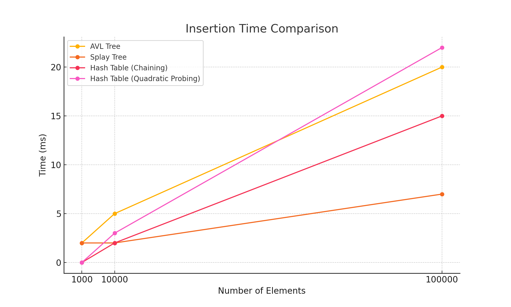
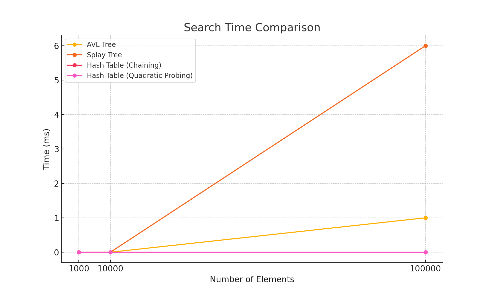
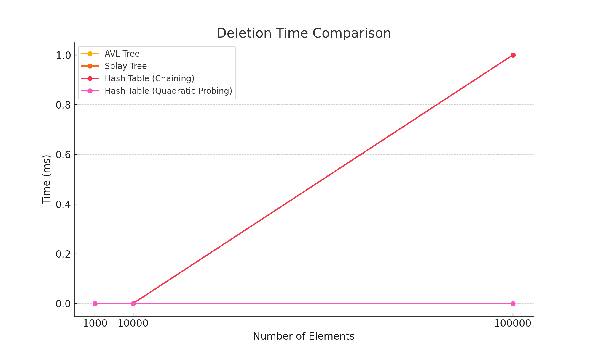

# CS 3345 – Assignment 2: Data Structure Performance Comparison

**Name:** Artin Seyrafi  
**NetID:** axs220370  
**Section:** 005  

---

## Overview

Java program which compares the performance of the following four different data structuresw:

- **AVL Tree** – Self-balancing binary search tree
- **Splay Tree** – Self-adjusting binary search tree
- **Hash Table (Chaining)** – Open hashing using linked lists
- **Hash Table (Quadratic Probing)** – Closed hashing using open addressing

Each structure supports insertion, deletion, and search operations. The task is to measure both execution time and memory usage.

---

## Experimental Setup

- **Input Sizes Tested:**
  - Small (N = 1,000)
  - Medium (N = 10,000)
  - Large (N = 100,000)

- **Operations Measured:**
  - Insertion of N random elements
  - Search of K (10% of N) random elements
  - Deletion of M (10% of N) random elements

- **Metrics:**
  - Time taken (in milliseconds)
  - Memory usage (in kilobytes)

---

## Analysis

**Insertion:**
| Data Structure                 | Elements | Insert Time | Memory Used |
|-------------------------------|----------|-------------|-------------|
| AVL Tree                      | 1,000    | 2 ms        | 983 KB      |
| Splay Tree                    | 1,000    | 2 ms        | 91 KB       |
| Hash Table (Chaining)         | 1,000    | 0 ms        | 34 KB       |
| Hash Table (Quadratic Probing)| 1,000    | 0 ms        | 0 KB        |
| AVL Tree                      | 10,000   | 5 ms        | 328 KB      |
| Splay Tree                    | 10,000   | 2 ms        | 335 KB      |
| Hash Table (Chaining)         | 10,000   | 2 ms        | 247 KB      |
| Hash Table (Quadratic Probing)| 10,000   | 3 ms        | 0 KB        |
| AVL Tree                      | 100,000  | 20 ms       | 3473 KB     |
| Splay Tree                    | 100,000  | 7 ms        | 3472 KB     |
| Hash Table (Chaining)         | 100,000  | 15 ms       | 2375 KB     |
| Hash Table (Quadratic Probing)| 100,000  | 22 ms       | 0 KB        |

**Searching:**

| Data Structure                 | Elements | Search Time |
|-------------------------------|----------|-------------|
| AVL Tree                      | 1,000    | 0 ms        |
| Splay Tree                    | 1,000    | 0 ms        |
| Hash Table (Chaining)         | 1,000    | 0 ms        |
| Hash Table (Quadratic Probing)| 1,000    | 0 ms        |
| AVL Tree                      | 10,000   | 0 ms        |
| Splay Tree                    | 10,000   | 0 ms        |
| Hash Table (Chaining)         | 10,000   | 0 ms        |
| Hash Table (Quadratic Probing)| 10,000   | 0 ms        |
| AVL Tree                      | 100,000  | 1 ms        |
| Splay Tree                    | 100,000  | 6 ms        |
| Hash Table (Chaining)         | 100,000  | 0 ms        |
| Hash Table (Quadratic Probing)| 100,000  | 0 ms        |

**Deletion**
| Data Structure                 | Elements | Delete Time |
|-------------------------------|----------|-------------|
| AVL Tree                      | 1,000    | 0 ms        |
| Splay Tree                    | 1,000    | 0 ms        |
| Hash Table (Chaining)         | 1,000    | 0 ms        |
| Hash Table (Quadratic Probing)| 1,000    | 0 ms        |
| AVL Tree                      | 10,000   | 0 ms        |
| Splay Tree                    | 10,000   | 0 ms        |
| Hash Table (Chaining)         | 10,000   | 0 ms        |
| Hash Table (Quadratic Probing)| 10,000   | 0 ms        |
| AVL Tree                      | 100,000  | 1 ms        |
| Splay Tree                    | 100,000  | 1 ms        |
| Hash Table (Chaining)         | 100,000  | 1 ms        |
| Hash Table (Quadratic Probing)| 100,000  | 0 ms        |

## Graphs

## Conclusion
Splay trees succeed in insertion speed when reaching high data sets but start lacking when searching or deleting elements. Hash tables are the best when it comes to searching and deleting, thought they take longer for insertion. Chaining is quicker for insertion than quadratic probing.
